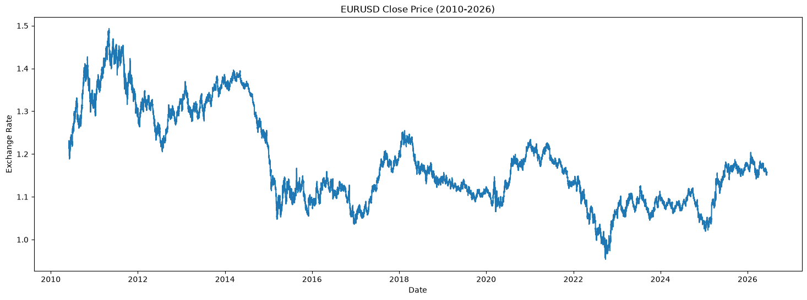

## My Observations

According to me and as can be seen in the "price analysis graph" , from the time range 2010 - 2026, there are few key points:

<ol>
<li> From around 2010 to 2015 EURUSD generally trends down, it starts at 1.2-1.5 and falls towards ~1.05-1.10</li>
<li> After that it mostly goes back and forth in the range ~ 1.0 and 1.25, with several swing cycle, no persistent trend can be observed</li>
</ol>

### Early Period
strong downtrend (easier for trend-following strategies like moving averages). more sideways / choppy behavior, with repeated rallies and pullbacks. A pure trend following MACD may see more in these zones because the trend isn’t clean

### Recent years

<ol>
<li>Early in the window, price drifts down slightly, then around early 2025 it starts a strong upward trend from roughly ~1.03 to around ~1.17–1.18.</li>
<li>After mid‑2025, it doesn’t keep trending up; instead, it oscillates around 1.15–1.18, forming a more sideways / range-bound region with local ups and downs rather than a strong trend.</li>
</ol>

Within the uptrend and the range, you can see repeated swings, In the early up-move, MACD will likely stay positive and give fewer, “cleaner” long signals; in the later choppy range, it will likely flip more often

### Distibution Analysis
No, this is not close to a single bell-shaped (normal) distribution. The mass looks heavier toward the lower/mid prices (around ~1.08–1.18) with a tail stretching to higher prices (~1.4–1.5).That suggests a right-skew (positive skew): more observations at lower values, fewer at the higher end,  there are multiple peaks

### return analysis
 there are fat tails relative to a normal with the same std,  Most observations cluster tightly around 0 (−0.0005 to +0.0005), we have some events  down to −2% and up to +1.7%. Those −2% and +1.7% returns are outliers relative to the bulk, The quartiles (−4.313e−4 vs +4.311e−4) and min/max being roughly similar magnitude suggest the distribution is roughly symmetric around zero

 ### Volatality analysis 
 long quiet patches roughly around 2013–2014 and again around 2019–2020, where volatility stays relatively low and stable

 Crisis / high-volatility spikes: Tall spikes (0.004–0.006) mark crisis-like days, where the 24‑hour volatility is several times the typical level.There is a big cluster around 2015–2016 with the highest spikes, and noticeable bursts again around 2020 and 2022–2024